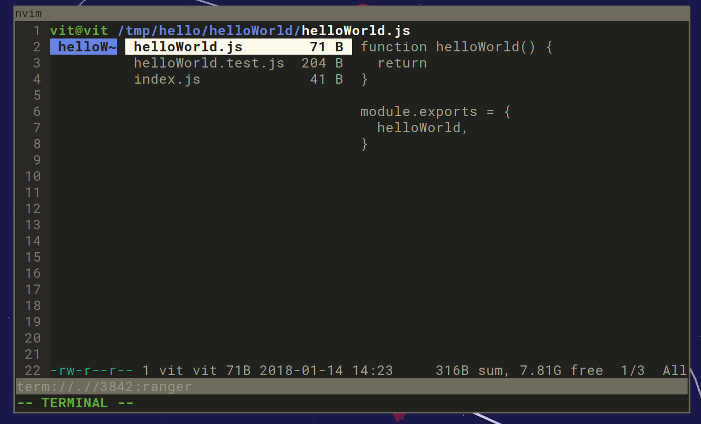

# make-js-module

Creates a directory with three files: `index.js`, `moduleName.js`, and `moduleName.tests.js`. `index.js` exports everything that exports `moduleName.js`. `moduleName.tests.js` is used for writing tests using `tape`. node.js' `require` function is used for exports.



## Installation

Copy the script into `/usr/local/bin`:

```bash
make install
```

Then, run with:
```bash
make-js-module <moduleName>
```

## License

MIT
